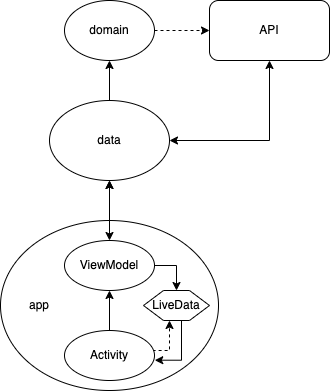

# My-Weather-Station

Basic Android app for showcasing good coding practices, primarily developed for a lecture which was part of the Illuminative workshop by
EESTEC LC Zagreb.

### Requirements:

- The app needs to implement OpenWeatherMap's Weather API
- API call example: https://api.openweathermap.org/data/2.5/weather?q={city}&appid={API_key}&units=metric
   

- The final app must contain two screens
- The first screen contains a text view for displaying the temperature and name of a chosen city, an input field and button for fetching
  data about the input city
- After clicking on the button, the user is taken to the second screen
- The second screen must display the following properties about the current weather conditions:
    - Location name
    - Weather explanation
    - Temperature
    - Humidity
    - Pressure
    - Wind speed
    - Geographical location data (latitude and longitude)
- In order to keep the app simple, back functionality will be handled through the back button (separate back button doesn't need to be added
  to the top bar)
- Some requirements, such as design and optimization, are omitted on purpose. They can be implemented at will

## Project structure

The following picture defines project structure and how information flows between layers of the application:
 

## Tech stack

- MVVM architecture
- Hilt
- LiveData
- Coroutines
- Retrofit
- Timber
